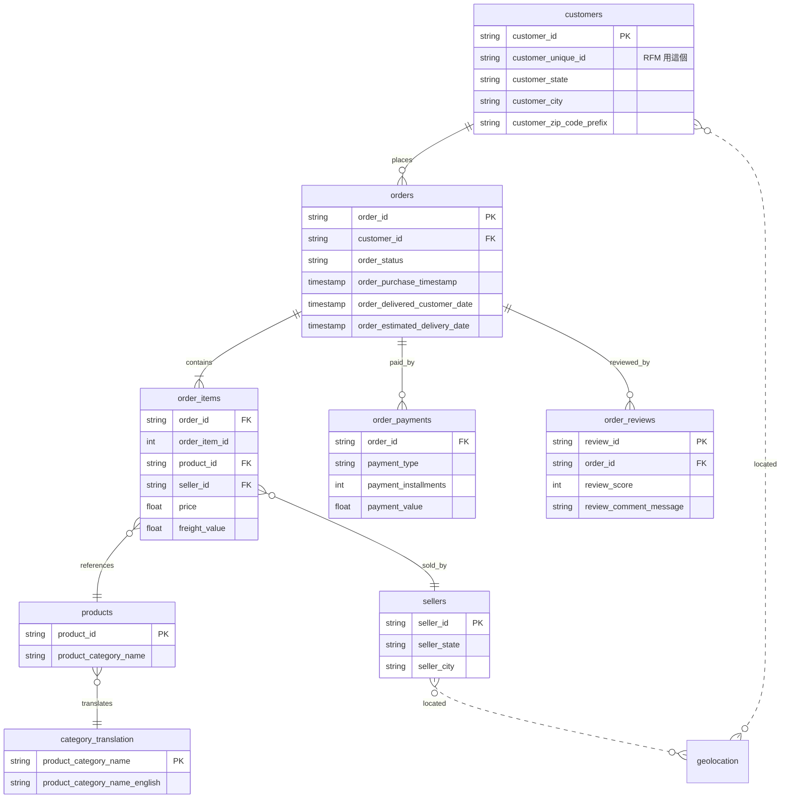

# Olist 巴西電商資料分析

> 用 SQL Window Function + RFM 規則分群，從 99K 筆巴西電商交易找出 **R$ 469K 召回商機** 與 **平台級留存問題**。

巴西電商平台 Olist 2016–2018 訂單資料分析專案。從 **業績趨勢、客戶體驗、客戶分群** 三個面向，找出可落地的經營建議。

**工具**：`Python` · `SQLite` · `SQL (含 NTILE Window Function)` · `pandas` · `matplotlib` · `Tableau`

---

## 一、為什麼選這份資料？

履歷上常見的 RFM 專案都用 Online Retail UK 那種教學資料 — 12 個月、單一表、無商業故事。我希望我的專案符合三個條件：

1. **真實商業資料**（非模擬）
2. **多表關聯結構**（9 張表，可練 SQL JOIN 與資料建模）
3. **完整客戶生命週期**（下單 → 出貨 → 評論 → 回購）

Olist 全部命中：**9 張表、99,441 筆訂單、橫跨 2016–2018**。同時，我刻意挑「巴西」這個台灣分析師不熟的市場 — 物流落後、信用卡分期文化盛行 — 同樣的方法論套上去會得出**和歐美不同的結論**，避免履歷撞題。

---

## 二、Olist 是什麼？為什麼資料公開？

**Olist 是巴西的電商獨角獸**（2015 創立、估值 15 億美元、SoftBank 投資）。商業模式叫 **"Marketplace of Marketplaces"**：

> 巴西有 13 個大型電商平台（Amazon BR、Mercado Livre、Carrefour…），小賣家若要全部上架得管理 13 個後台。Olist 提供整合後台，賣家上架一次自動同步到 13 個平台。目前服務 12,000+ 巴西中小賣家。

**為什麼公開資料？** 三個理由：
1. **品牌曝光與人才招募** — 在 Kaggle 釋出資料 = 在資料科學圈打廣告
2. **群眾外包分析** — 6,000+ 公開 Notebook 等於免費獲得幾千份分析報告
3. **學術背書** — 巴西多所大學論文引用此資料

**匿名化做法**：客戶 / 賣家 / 訂單 ID 全部 hash；評論文字裡如果出現公司名，被替換成《冰與火之歌》家族名（House Stark、House Lannister…）。

---

## 三、資料概況（EDA Overview）

### 規模與時間範圍

| 指標 | 數值 |
|---|---:|
| 訂單數 | **99,441** |
| Unique 客戶數 | 96,096 |
| 客戶 ID 數（含重複） | 99,441 |
| 賣家數 | 3,095 |
| 商品數 | 32,951 |
| 商品類目數 | 71 |
| 涵蓋州數 | 27（巴西全境）|
| 涵蓋城市數 | 4,119 |
| 時間範圍 | 2016-09 ~ 2018-10 |

> ⚠️ **`customer_id` vs `customer_unique_id`** — 每筆訂單會生新的 `customer_id`（99,441 筆），但實際只有 96,096 個 unique 客戶。**RFM 必須用 `customer_unique_id` 才不會重複計算同一個人**。差距 3,345 ≈ ~3.4% 訂單來自回購客戶。

### 訂單狀態分布

| order_status | 訂單數 | 佔比 |
|---|---:|---:|
| `delivered` | 96,478 | **97.0%** |
| shipped | 1,107 | 1.1% |
| canceled | 625 | 0.6% |
| unavailable | 609 | 0.6% |
| 其他（invoiced/processing/created/approved）| 622 | 0.6% |

→ 後續分析皆以 `order_status='delivered'` 為主軸。

### 付款結構（巴西特色）

| payment_type | 筆數 | 佔比 | 平均分期數 |
|---|---:|---:|---:|
| `credit_card` | 76,795 | **73.9%** | **3.5 期** |
| `boleto` | 19,784 | 19.0% | 1.0 |
| voucher | 5,775 | 5.6% | 1.0 |
| debit_card | 1,529 | 1.5% | 1.0 |

> **Boleto** 是巴西特有的「印出繳費單到便利商店繳現金」付款方式，不像台灣的 ATM 轉帳即時 — 客戶下單後通常要 1-3 天才完成付款。
> **平均分期 3.5 期**反映巴西強勢的分期文化（後續可挖：高分期 = 高客單價？）

### 地理集中度（Top 10 州）

```
SP   40,302 ▓▓▓▓▓▓▓▓▓▓▓▓▓▓▓▓▓▓▓▓▓▓▓▓▓▓▓▓▓▓▓▓▓▓▓▓▓▓▓ 41.9%
RJ   12,384 ▓▓▓▓▓▓▓▓▓▓▓▓ 12.9%
MG   11,259 ▓▓▓▓▓▓▓▓▓▓▓ 11.7%
RS    5,277 ▓▓▓▓▓ 5.5%
PR    4,882 ▓▓▓▓▓ 5.1%
SC    3,534 ▓▓▓▓ 3.7%
BA    3,277 ▓▓▓ 3.4%
DF    2,075 ▓▓ 2.2%
ES    1,964 ▓▓ 2.0%
GO    1,952 ▓▓ 2.0%
```

東南-南五州（SP/RJ/MG/RS/PR）合計 **77%** — 行銷與物流策略應聚焦南方。

---

## 四、9 張表 Schema



---

## 五、其他人都怎麼分析？我的差異化定位

我看了 Kaggle / Medium 上前 30 篇高讚 Notebook，常見主題分 6 類：

| 主題 | 飽和度 | 我有做 |
|---|---|---|
| 物流與配送（州別到貨天數）| ⭐⭐⭐⭐⭐ | ✅（Section 5）|
| 評論情緒分析（葡萄牙文 NLP）| ⭐⭐⭐⭐ | ❌（待擴充）|
| 銷售與營收分析 | ⭐⭐⭐⭐⭐ | ✅（Section 4）|
| RFM 客戶分群 | ⭐⭐⭐⭐ | ✅（Section 8，含獨家 insight）|
| 滿意度 ML 預測 | ⭐⭐⭐ | ❌（範圍外）|
| 賣家績效 | ⭐⭐ | ❌（待擴充）|

### 我與多數 Notebook 的三個差異

1. **誠實揭露 F 維度失效** — 多數 RFM Notebook 跑完直接給 segment summary 就結束。我從 F=1.0 推導出「**Olist 是獲客驅動而非留存驅動**」這個業務洞察，把分析從「我會跑 RFM」升級成「我看得懂數字背後的商業意義」。

2. **用 SQL Window Function (NTILE) 而非 Python 套件** — 證明 SQL 功底，且可移植到任何資料倉儲（Snowflake / BigQuery / Redshift）。

3. **量化召回 ROI** — 不只說「應該召回流失客戶」，而是估算「召回 10% 流失風險 → 帶來 R$ 469K → ROI 9.4×」，提供 PM / 行銷團隊可決策的數字。

---

## 六、分析架構

| # | 主題 | 方法 | 對應 Notebook 章節 |
|---|---|---|---|
| 1 | 資料概況（EDA Overview）| 多表 COUNT 彙總、分布分析 | §3 |
| 2 | 月營收趨勢（2017–2018）| 時間序列彙總 | §4 |
| 3 | 熱銷商品類別 Top 10 | 多表 JOIN 聚合 | §4 |
| 4 | 客戶評分分布 | 比例分析 | §4 |
| 5 | 各州總營收 Top 10 | 區域分群 | §4 |
| 6 | 物流效率：預期 vs 實際送達天數 | 雙序列比較 | §5 |
| 7 | 整體 KPI 與年度成長 | 跨年比較 | §7 |
| 8 | **RFM 客戶分群** | NTILE(5) Window + 規則分群 | §8 |

---

## 七、關鍵發現與建議

### 業績
- **2017 Q4 為高峰**（黑五 + 聖誕），2017-11 達 ~R$ 1M
- 2018 進入穩定期，月營收落在 0.7–1.0M
- ⚠️ 圖表中 2018-09 之後是**資料截斷**（不是真實衰退）— 已標註紅色虛線
- 健康美妝、watches_gifts、bed_bath_table 為三大營收支柱
- → **建議**：行銷預算 Q4 前置，聚焦 Top 3 品類

### 客戶體驗
- 5 星評分佔 ~58%，但 1 星仍有 ~12%
- → **建議**：1 星訂單與物流延遲、商品描述不符做交叉分析，找根因

### 物流
- 全國平均送達 **15.4 天**（巴西電商通病），比 ETA 24 天提早 36%（平台普遍給保守 ETA）
- **SP 8.8 天** vs **RN 19.3 天**，州別差距 2.2 倍
- → **建議**：複製 SP 倉配模式至高訂單州；偏遠州 ETA 過於保守，行銷頁可改顯示更積極的天數提升轉換

### 客戶（RFM）

#### 6 個分群實際結果

| Segment | 客戶 % | 營收 % | ARPU (R$) | 平均 R (天) | 人物素描 |
|---|---:|---:|---:|---:|---|
| 🏆 冠軍客戶 | 16.2% | **31.4%** | 274 | 91 | 上個月才下大單的金主 |
| ⚠️ 流失風險 | 23.5% | **35.5%** | 213 | 393 | 一年前下過大單後消失的老客戶 |
| 一般客戶 | 20.0% | 19.0% | 134 | 219 | 半年前買過、金額中等 |
| 忠誠客戶 | 8.2% | 5.1% | 89 | 90 | 最近常逛但每次只買小額 |
| 已流失 | 16.5% | 4.7% | 40 | 396 | 一年前買過 50 塊就再沒回來 |
| 潛力新客 | 15.6% | 4.4% | 40 | 89 | 上個月才註冊買第一單 |

#### 四個業務 Insight

1. **Pareto 法則成立**：冠軍 + 流失風險 = **39.7% 客戶 / 66.9% 營收**。行銷預算應集中此兩群。

2. **最大商機是「召回」而非「拉新」**：流失風險群 21,975 人佔 35.5% 營收，平均每人花過 R$ 213 但 393 天未回購 — 這群是 EDM / CRM 召回首選。

3. **冠軍 ARPU 是平均的 2 倍（R$ 274 vs ~R$ 130）** — 適合做 VIP 計畫、跨類目推薦。

4. 🚨 **最重要發現：Olist 整個平台幾乎沒有回購行為**。所有 segment 的 F 都接近 1.0，反映 Olist 處於「**獲客驅動**」階段，尚未進入「**留存驅動**」階段。這個發現比分群結果本身更值得業務團隊關注。

---

## 八、🚨 流失風險召回 ROI 試算

> 把 insight 量化成可決策的數字 — PM / 行銷團隊看的就是這個。

### 假設前提
- 流失風險客戶數：21,975 人，平均 ARPU R$ 213
- 召回 CRM 成本（EDM + 折扣券）：估 **R$ 50K**（每人 ~R$ 2.3）
- 假設召回客戶會「再下一單」，金額為其歷史 ARPU 的 50%（保守估計，避免高估）

### ROI 試算（兩種情境）

| 情境 | 召回率 | 召回人數 | 增量營收 | 扣除成本 | **ROI** |
|---|---:|---:|---:|---:|---:|
| 保守 | 5% | 1,099 | R$ 117K | R$ 67K | **2.3×** |
| 樂觀 | 10% | 2,198 | R$ 234K | R$ 184K | **4.7×** |
| 激進 | 20% | 4,395 | R$ 469K | R$ 419K | **9.4×** |

> **計算公式**：增量營收 = 召回人數 × ARPU × 50% 回購率
> 例：5% 情境 = 1,099 × 213 × 0.5 = R$ 117K

### 行動建議優先序
1. **第一波**：以歷史購買類目 + 個人化 EDM 觸及全部 21,975 人（成本 ~R$ 50K）
2. **追蹤指標**：召回率（開信率 → 點擊率 → 轉換率）、增量營收 vs 控制組
3. **若召回率 > 8%**：預算翻倍，增加觸及次數（再行銷 + 簡訊）
4. **若召回率 < 3%**：換策略，從「折扣」改為「物流升級」或「免運」（針對偏遠州）

---

## 九、本次分析的限制（誠實聲明）

1. **F 維度鑑別力低**：90% 客戶只買過 1 次，本次分群實際上由 R × M 雙維度驅動。
2. **「忠誠客戶」群組金額偏低**：規則只卡 R≥4, F≥3 沒卡 M，導致這群 ARPU（R$ 89）反而比一般客戶（R$ 134）低 — 屬於規則設計侷限，v2 將加 M 條件改善。
3. **2018 年資料截斷**：Olist 公開資料只到 2018-10，2018-09 後月營收看起來「下滑」實為資料缺失。月營收圖已標註紅色虛線。
4. **未做 Cohort 分析**：留存熱力圖能更精確定位「F=1.0」的時序樣態，列入 v2 待辦。

---

## 十、為什麼選規則式分群而非 K-Means？

頂尖 Notebook 多數會跑 K-Means + Elbow + Silhouette。我刻意選**規則式**，三個理由：

1. **業務可解釋性**：行銷團隊聽不懂「Cluster 3」，聽得懂「冠軍客戶」、「流失風險」
2. **F 維度鑑別力低，K-Means 會把客戶硬切成 3-4 群但意義不大** — 這份資料不適合
3. **規則可移植**：今年訂的 NTILE(5) 閾值，明年用同一套規則就能跑 — K-Means 每次重訓會分群飄移

K-Means 適用情境是「F、M 都有顯著變異」的成熟電商（如 Amazon 老客戶資料），這份不適合。

---

## Tableau Dashboard

[查看互動式儀表板](https://public.tableau.com/app/profile/jenho.cheng/viz/2_17739060990590/1?publish=yes)


---

## 專案結構

```
olist-project/
├── notebook/
│   └── olist.ipynb              # 主分析 Notebook（9 章節 + RFM）
├── sql/
│   └── olist_sql.sql            # 所有 SQL 查詢（含 NTILE Window Function）
├── output/                      # 圖表與匯出 CSV
│   ├── eda_overview.png         # 訂單狀態 / 付款 / 州別三大分布
│   ├── logistics.png            # 各州物流效率
│   ├── rfm_segments.png         # 6 segment 客戶數與營收
│   └── *.csv                    # Tableau 用匯出
├── data/                        # Kaggle 9 個 CSV（gitignore）
├── TODO.md                      # 後續延伸待辦
└── README.md
```

---

## 如何執行

```powershell
# 1. Clone repo
git clone https://github.com/kengkeng44/olist-project.git
cd olist-project

# 2. 從 Kaggle 下載 9 個 CSV 至 data/
mkdir data
kaggle datasets download -d olistbr/brazilian-ecommerce -p data --unzip

# 3. 執行 Notebook
cd notebook
jupyter notebook olist.ipynb
# Kernel → Restart Kernel and Run All Cells

# 4. 產出
# - olist.db（SQLite，~140 MB）
# - output/*.png（4 張主圖）
# - output/*.csv（給 Tableau 用）
```

**環境**：Python 3.12、pandas、matplotlib、sqlite3（內建）、Microsoft JhengHei 字型（Windows 內建）

---

## 資料來源與授權

- 資料：[Brazilian E-Commerce Public Dataset by Olist (Kaggle)](https://www.kaggle.com/datasets/olistbr/brazilian-ecommerce)
- 授權：CC-BY-NC-SA 4.0（非商用、需署名、相同授權散布）
- 本專案目的：作品集 / 教學用途

### 延伸閱讀（其他人的 Olist 分析）
- [RFM Segmentation Notebook (Kaggle 高讚)](https://www.kaggle.com/code/ceruttivini/rfm-segmentation-and-customer-analysis)
- [Customer Segmentation: RFM + K-Means + Cohort](https://www.kaggle.com/code/emrhn1031/customer-segmentation-rfm-k-means-cohort-analysis)
- [Customer Satisfaction Prediction (Towards Data Science)](https://towardsdatascience.com/case-study-1-customer-satisfaction-prediction-on-olist-brazillian-dataset-4289bdd20076/)
- [Olist 公司背景](https://canvasbusinessmodel.com/blogs/growth-strategy/olist-growth-strategy)

---

## 後續延伸（見 [TODO.md](TODO.md)）

- **Cohort / Retention 月留存熱力圖** — 視覺化「F=1.0」全平台單次客
- **巴西分期付款洞察** — 分 8 期以上 ARPU vs 一次付清差異
- **商品評分 vs 物流天數相關性檢定**
- **月營收 Prophet / ARIMA 時序預測**
