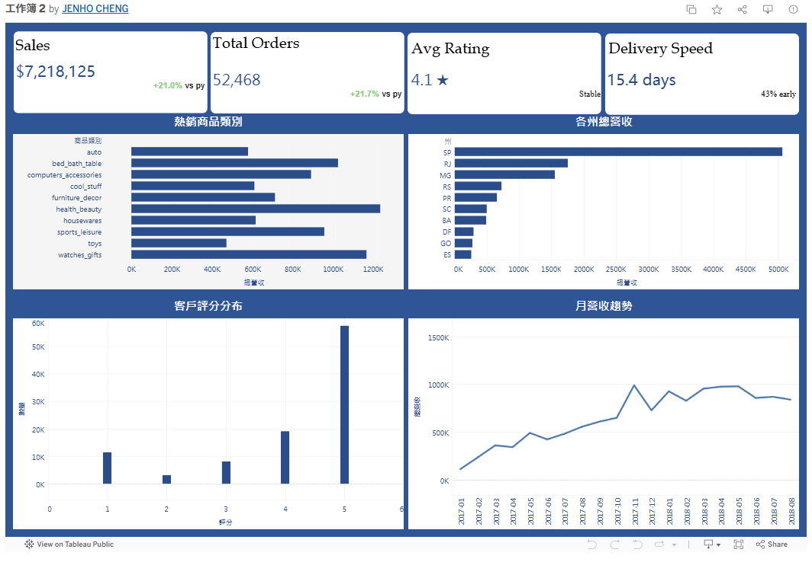

# Olist 巴西電商資料分析

巴西電商平台 Olist 2016–2018 訂單資料分析專案。
從 **業績趨勢、客戶體驗、客戶分群** 三個面向，找出可落地的經營建議。

## 工具

`Python` · `SQLite` · `SQL (含 Window Function)` · `pandas` · `matplotlib` · `Tableau`

## 分析架構

| # | 主題 | 方法 |
|---|---|---|
| 1 | 月營收趨勢（2017–2018） | 時間序列彙總 |
| 2 | 熱銷商品類別 Top 10 | 多表 JOIN 聚合 |
| 3 | 客戶評分分布 | 比例分析 |
| 4 | 各州總營收 Top 10 | 區域分群 |
| 5 | 各州物流效率：預期 vs 實際送達天數 | 雙序列比較 |
| 6 | **RFM 客戶分群** | NTILE 五分位 + 規則分群 |

---

## 關鍵發現與建議

### 業績
- **2017 Q4 為高峰**（黑五、聖誕），2017-11 達 ~1M；2018 進入穩定期，月營收落在 0.7–1.0M
- 健康美妝、watches_gifts、bed_bath_table 為三大營收支柱
- → **建議**：行銷預算 Q4 前置，聚焦 Top 3 品類

### 客戶體驗
- 5 星評分佔 ~58%，但 1 星仍有 ~12%
- → **建議**：將 1 星訂單與物流延遲、商品描述不符做交叉分析，找根因

### 物流
- 全國平均送達 15.4 天，比預期 ~24 天提早 ~36%
- **SP 8.8 天，RN 19.3 天**，州別差距明顯
- → **建議**：複製 SP 倉配模式至高訂單州；偏遠州 ETA 過於保守，行銷頁可改顯示更積極的天數

### 客戶（RFM）
- 客戶以「一次性購買」為主，**冠軍 / 忠誠客戶佔比偏低**
- 「已流失」群組客戶數佔比最大，「流失風險」群組平均消費金額較高
- → **建議**：

  | 分群 | 行動 |
  |---|---|
  | 冠軍 | VIP 制度、新品優先試用 |
  | 忠誠 | 訂閱制、回購折扣 |
  | 潛力新客 | 首購回饋 + 48h 限時券，催出第二筆訂單 |
  | 流失風險 | 個人化召回 EDM、限時免運 |
  | 已流失 | 大額折扣 + 滿意度問卷找原因 |

---

## Tableau Dashboard

[查看互動式儀表板](https://public.tableau.com/app/profile/jenho.cheng/viz/2_17739060990590/1?publish=yes)



---

## 專案結構

```
olist-project/
├── notebook/
│   └── olist.ipynb        # 主分析 Notebook（含 8 章節 + RFM）
├── sql/
│   └── olist_sql.sql      # 所有 SQL 查詢（含 RFM Window Function）
├── output/                # 圖表與匯出 CSV
└── README.md
```

## 如何執行

1. 從 [Kaggle](https://www.kaggle.com/datasets/olistbr/brazilian-ecommerce) 下載 9 個 CSV 至 `data/`
2. 開啟 `notebook/olist.ipynb`，依序執行
3. 產出 `olist.db`（SQLite）與 `output/` 內的圖表 / CSV
4. 將 CSV 載入 Tableau 重建儀表板

## 資料來源

[Olist Brazilian E-Commerce Dataset - Kaggle](https://www.kaggle.com/datasets/olistbr/brazilian-ecommerce)

---

## 後續延伸

- **Cohort 分析**：每月新客的 N 個月後留存率
- **相關性檢定**：商品評分 vs 物流天數（scipy.stats）
- **時間序列預測**：月營收 Prophet / ARIMA 模型
