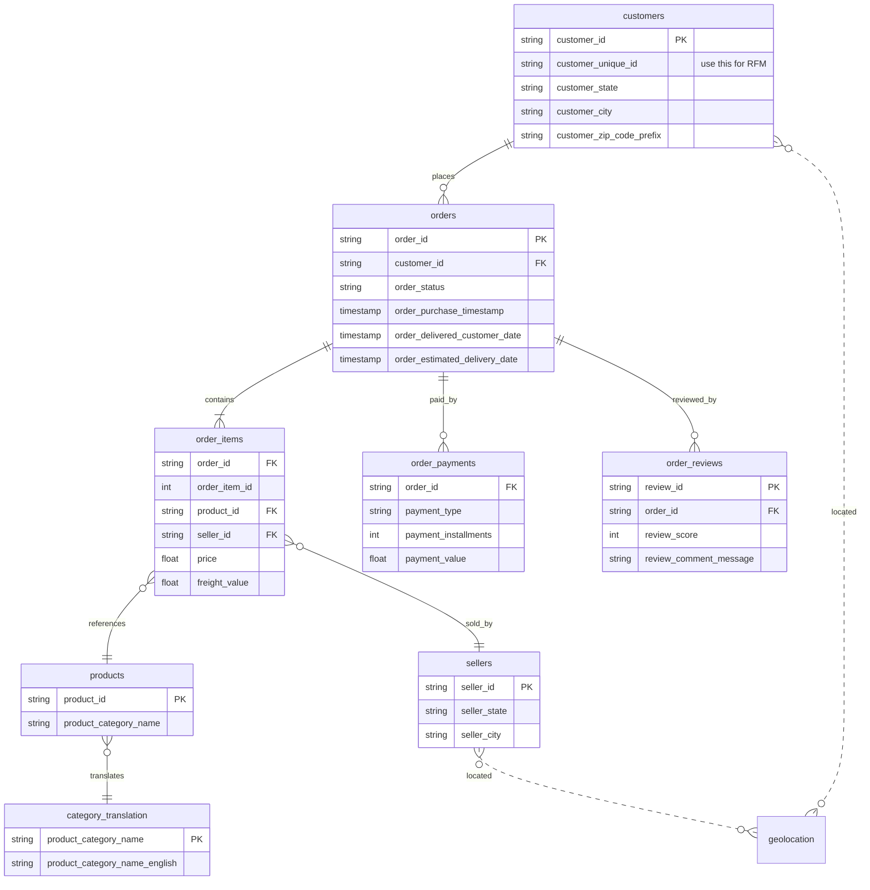

# Olist Brazilian E-Commerce Analysis

**English** · **[繁體中文](README.zh-TW.md)**

> Used SQL Window Function + rule-based RFM segmentation to surface a **R$ 469K win-back opportunity** and a **platform-wide retention failure** from 99K Brazilian e-commerce transactions.

**🚀 [Streamlit App](https://olist-jenho.streamlit.app/)** · **📈 [Excel Portfolio](output/portfolio.xlsx)** ([📘 Guide](docs/excel_portfolio_guide.md)) · **📊 [HTML Dashboard](https://kengkeng44.github.io/olist-project/)** · **📊 [Tableau](https://public.tableau.com/app/profile/jenho.cheng/viz/2_17739060990590/1?publish=yes)** · **📑 [Interview Deck (PDF)](slides/portfolio.pdf)** · **🃏 [Sister project: Cookie Cats A/B](https://cookie-cats-jenho.streamlit.app/)**

A 2016–2018 order analysis project on the Brazilian e-commerce marketplace Olist. Three angles — **revenue trends, customer experience, customer segmentation** — surface actionable business recommendations.

**Tools**: `Python` · `SQLite` · `SQL (NTILE Window Function)` · `pandas` · `matplotlib` · `Streamlit` · `Tableau`

---

## 1. Why this dataset?

Most RFM projects on resumes use the Online Retail UK teaching dataset — 12 months, single table, no business story. I wanted my project to meet three criteria:

1. **Real commercial data** (not simulated)
2. **Multi-table relational structure** (9 tables, real SQL JOIN + data modeling practice)
3. **Full customer lifecycle** (order → ship → review → repurchase)

Olist hits all three: **9 tables, 99,441 orders, 2016–2018**. I also deliberately picked "Brazil" — a market Taiwanese analysts are unfamiliar with (poor logistics, strong credit-card installment culture) — so the same methodology yields **different conclusions from US/EU** and avoids resume duplication.

---

## 2. What is Olist? Why is the data public?

**Olist is a Brazilian e-commerce unicorn** (founded 2015, valued at USD 1.5B, SoftBank-backed). The business model is **"Marketplace of Marketplaces"**:

> Brazil has 13 major e-commerce platforms (Amazon BR, Mercado Livre, Carrefour, etc.). Small sellers wanting to list everywhere have to manage 13 back-offices. Olist provides a unified back-office: list once, auto-sync to all 13 platforms. Today it serves 12,000+ SMB sellers across Brazil.

**Why publish the data?** Three reasons:
1. **Brand visibility + recruiting** — releasing on Kaggle = advertising in the data science community
2. **Crowdsourced analysis** — 6,000+ public notebooks = thousands of free analysis reports
3. **Academic credibility** — referenced in multiple Brazilian university theses

**Anonymization**: customer / seller / order IDs are all hashed; if a company name appears in review text it's replaced with a *Game of Thrones* house name (House Stark, House Lannister, …).

---

## 3. EDA Overview

### Scale and timeframe

| Metric | Value |
|---|---:|
| Orders | **99,441** |
| Unique customers | 96,096 |
| Customer IDs (incl. duplicates) | 99,441 |
| Sellers | 3,095 |
| Products | 32,951 |
| Product categories | 71 |
| States covered | 27 (all of Brazil) |
| Cities covered | 4,119 |
| Time range | 2016-09 ~ 2018-10 |

> ⚠️ **`customer_id` vs `customer_unique_id`** — each order spawns a new `customer_id` (99,441 total), but there are only 96,096 unique customers in reality. **RFM must use `customer_unique_id`** to avoid double-counting the same person. The 3,345 gap ≈ ~3.4% of orders coming from returning customers.

### Order status distribution

| order_status | Orders | Share |
|---|---:|---:|
| `delivered` | 96,478 | **97.0%** |
| shipped | 1,107 | 1.1% |
| canceled | 625 | 0.6% |
| unavailable | 609 | 0.6% |
| other (invoiced / processing / created / approved) | 622 | 0.6% |

→ All downstream analysis filters on `order_status='delivered'`.

### Payment structure (Brazilian context)

| payment_type | Count | Share | Avg installments |
|---|---:|---:|---:|
| `credit_card` | 76,795 | **73.9%** | **3.5** |
| `boleto` | 19,784 | 19.0% | 1.0 |
| voucher | 5,775 | 5.6% | 1.0 |
| debit_card | 1,529 | 1.5% | 1.0 |

> **Boleto** is a Brazilian-only payment method: print a payment slip, pay cash at a convenience store. Unlike instant ATM transfers, it typically takes 1–3 days for the payment to clear after ordering.
> The **3.5 average installments** reflects Brazil's strong installment culture (we'll dig into "long installments → high ticket?" later).

### Geographic concentration (Top 10 states)

```
SP   40,302 ▓▓▓▓▓▓▓▓▓▓▓▓▓▓▓▓▓▓▓▓▓▓▓▓▓▓▓▓▓▓▓▓▓▓▓▓▓▓▓ 41.9%
RJ   12,384 ▓▓▓▓▓▓▓▓▓▓▓▓ 12.9%
MG   11,259 ▓▓▓▓▓▓▓▓▓▓▓ 11.7%
RS    5,277 ▓▓▓▓▓ 5.5%
PR    4,882 ▓▓▓▓▓ 5.1%
SC    3,534 ▓▓▓▓ 3.7%
BA    3,277 ▓▓▓ 3.4%
DF    2,075 ▓▓ 2.2%
ES    1,964 ▓▓ 2.0%
GO    1,952 ▓▓ 2.0%
```

The southeast–south five states (SP/RJ/MG/RS/PR) account for **77%** combined — marketing and logistics strategy should concentrate on the south.

---

## 4. 9-table Schema



---

## 5. How do others analyze this? My differentiation

I reviewed the top 30 most-upvoted notebooks on Kaggle / Medium. Common topics fall into 6 buckets:

| Topic | Saturation | Did I cover it? |
|---|---|---|
| Logistics & delivery (state-level delivery days) | ⭐⭐⭐⭐⭐ | ✅ (Section 7) |
| Review sentiment (Portuguese NLP) | ⭐⭐⭐⭐ | ❌ (future scope) |
| Sales & revenue analysis | ⭐⭐⭐⭐⭐ | ✅ (Section 7) |
| RFM customer segmentation | ⭐⭐⭐⭐ | ✅ (Section 7, with unique insight) |
| Satisfaction ML prediction | ⭐⭐⭐ | ❌ (out of scope) |
| Seller performance | ⭐⭐ | ❌ (future scope) |

### Three differentiators vs. most notebooks

1. **Honestly disclose the F-dimension failure** — most RFM notebooks stop at segment summary. I derive from F=1.0 the business insight that **"Olist is acquisition-driven, not retention-driven"** — upgrading the analysis from "I can run RFM" to "I understand what the numbers mean for the business."

2. **SQL Window Function (NTILE), not Python libraries** — proves SQL chops, and is portable to any data warehouse (Snowflake / BigQuery / Redshift).

3. **Quantified win-back ROI** — not just "we should win back churned customers," but estimating "win back 10% of at-risk → R$ 469K → 9.4× ROI" — actionable numbers for PM / marketing decisions.

---

## 6. Analysis architecture

| # | Topic | Method | Notebook section |
|---|---|---|---|
| 1 | EDA Overview | Multi-table COUNT aggregation, distribution analysis | §3 |
| 2 | Monthly revenue trend (2017–2018) | Time series aggregation | §4 |
| 3 | Top 10 best-selling product categories | Multi-table JOIN aggregation | §4 |
| 4 | Customer review score distribution | Proportion analysis | §4 |
| 5 | Top 10 states by total revenue | Regional segmentation | §4 |
| 6 | Logistics efficiency: ETA vs. actual delivery days | Dual-series comparison | §5 |
| 7 | Overall KPIs and YoY growth | Cross-year comparison | §7 |
| 8 | **RFM customer segmentation** | NTILE(5) Window + rule-based grouping | §8 |
| 9 | **Cohort retention heatmap** | Monthly cohort × N-month active rate | `notebook/cohort_analysis.py` |
| 10 | **Installments vs. ARPU & repurchase** | 5-bucket grouping × dual metrics | `notebook/installments_analysis.py` |

---

## 7-pre. Core SQL — RFM with NTILE Window Function

> Full SQL lives in [`sql/olist_sql.sql`](sql/olist_sql.sql). The snippet below is the RFM segmentation core — proving SQL competence rather than library dependency.

```sql
-- Use NTILE(5) Window Function to bin R/F/M into quintiles,
-- then compose 6 business segments via rules
WITH snapshot AS (
    SELECT MAX(order_purchase_timestamp) AS snapshot_date
    FROM orders WHERE order_status = 'delivered'
),
rfm_base AS (
    SELECT
        c.customer_unique_id,                                   -- ⚠️ unique_id, NOT customer_id
        ROUND(JULIANDAY((SELECT snapshot_date FROM snapshot)) -
              JULIANDAY(MAX(o.order_purchase_timestamp)), 0) AS recency_days,
        COUNT(DISTINCT o.order_id) AS frequency,
        ROUND(SUM(oi.price), 2)    AS monetary
    FROM orders o
    JOIN order_items oi ON o.order_id = oi.order_id
    JOIN customers   c  ON o.customer_id = c.customer_id
    WHERE o.order_status = 'delivered'
    GROUP BY c.customer_unique_id
),
rfm_scored AS (
    SELECT *,
           NTILE(5) OVER (ORDER BY recency_days DESC) AS r_score,
           NTILE(5) OVER (ORDER BY frequency    ASC)  AS f_score,
           NTILE(5) OVER (ORDER BY monetary     ASC)  AS m_score
    FROM rfm_base
)
SELECT
    CASE
        WHEN r_score >= 4 AND f_score >= 4 AND m_score >= 4 THEN 'Champions'
        WHEN r_score >= 4 AND f_score >= 3                  THEN 'Loyal'
        WHEN r_score >= 4                                   THEN 'Potential New'
        WHEN r_score <= 2 AND f_score >= 3                  THEN 'At Risk'
        WHEN r_score <= 2                                   THEN 'Lost'
        ELSE                                                     'Average'
    END AS segment,
    COUNT(*)                AS customers,
    ROUND(AVG(monetary), 2) AS arpu,
    ROUND(SUM(monetary), 2) AS segment_revenue
FROM rfm_scored GROUP BY segment ORDER BY segment_revenue DESC;
```

**Why NTILE instead of pandas qcut?**

| Comparison | NTILE (SQL) | pandas qcut |
|---|---|---|
| Portability | Snowflake / BigQuery / Redshift / SQLite all support it | Python-only |
| Big data | Runs in-DB, fast even on tens of millions of rows | Have to pull 100M rows into Python memory |
| Scheduling | Slots directly into dbt / Airflow, writes back to DW | Needs wrapper code |
| **Industry signal** | **"Can use DW" → senior level** | "Can use Python" → entry level |

---

## 7. Key findings & recommendations

### Revenue
- **2017 Q4 is the peak** (Black Friday + Christmas), 2017-11 hits ~R$ 1M
- 2018 enters a plateau, monthly revenue stays at 0.7–1.0M
- ⚠️ The "decline" after 2018-09 in the chart is **data truncation**, not real decay — marked with a red dashed line
- Health & Beauty, watches_gifts, bed_bath_table are the top-3 revenue pillars
- → **Recommendation**: front-load marketing budget before Q4, concentrate on top-3 categories

### Customer experience
- 5-star reviews ~58%, but 1-star is still ~12%
- → **Recommendation**: cross-analyze 1-star orders against delivery delays and product description mismatches to find root causes

### Logistics
- National average delivery **15.4 days** (a chronic Brazilian e-commerce issue), 36% earlier than the 24-day ETA (the platform gives conservative ETAs)
- **SP 8.8 days** vs. **RN 19.3 days** — 2.2× state-level gap
- → **Recommendation**: replicate SP's warehouse/logistics model in other high-order states; tighten ETA promises for remote states (current ones are overly conservative — frontend can show more aggressive days to lift conversion)

### Customer (RFM)

#### Six segments — actual results

| Segment | Customer % | Revenue % | ARPU (R$) | Avg R (days) | Persona |
|---|---:|---:|---:|---:|---|
| 🏆 Champions | 16.2% | **31.4%** | 274 | 91 | Big-ticket buyer who placed a large order last month |
| ⚠️ At Risk | 23.5% | **35.5%** | 213 | 393 | High-value customer who vanished ~13 months ago |
| Average | 20.0% | 19.0% | 134 | 219 | Bought half a year ago, mid-ticket |
| Loyal | 8.2% | 5.1% | 89 | 90 | Recent + frequent but low ticket |
| Lost | 16.5% | 4.7% | 40 | 396 | Bought R$50 a year ago, never came back |
| Potential New | 15.6% | 4.4% | 40 | 89 | Just signed up + placed a first small order |

#### Four business insights

1. **Pareto holds**: Champions + At Risk = **39.7% of customers / 66.9% of revenue**. Marketing spend should concentrate here.

2. **Biggest opportunity is "win-back," not "acquisition"**: At-Risk has 21,975 customers, 35.5% of revenue, R$ 213 historical ARPU each, 393 days dormant — prime EDM / CRM win-back targets.

3. **Champions ARPU is 2× the platform average (R$ 274 vs ~R$ 130)** — fit for a VIP program, cross-category recommendations.

4. 🚨 **Most important finding: Olist has almost zero repeat purchase behavior platform-wide**. Frequency stays ≈ 1.0 across every segment, meaning Olist is still in the **"acquisition-driven"** stage, not yet **"retention-driven."** This finding deserves business-team attention more than the segmentation result itself.

---

## 8. Cohort retention heatmap — hard proof of F=1.0

> The previous chapter deduced "Olist is acquisition-driven, not retention-driven" from RFM rules. This chapter **quantitatively validates** that conclusion via cohort analysis.

### Method
- Each customer's "first purchase month" becomes their cohort
- Track the share of that cohort still placing orders in each of the next N months (cell value = active in month / cohort size)
- Use `customer_unique_id` to track the same person across orders

### Result


### Reading the heatmap
1. **M0 is 100% across the board** — first-purchase month is always 100% by definition
2. **M1 is consistently 0.2–0.7%** — 99%+ vanish the next month. A mature e-commerce platform's M1 should be **5–15%**
3. **Entire heatmap is uniformly yellow-white** — no cohort recovers in any later month
4. **Out of 93,358 unique customers, only 1,693 (1.81%) ordered in more than one month** — platform-wide single-purchase phenomenon

### Business implications
- Repurchase isn't "low" — it's **almost nonexistent**. Olist isn't short of new customers; it's short of reasons for them to come back.
- This finding deserves PM / CRM-team priority over the "Champions vs At-Risk" segmentation.
- Corresponds to Chapter 9's ROI win-back strategy — the R$ 469K is really "**building repurchase from scratch**," harder than "winning back" on a mature platform.
- Three hypotheses left for v2: (a) Brazil e-commerce industry-wide pattern? (b) Olist's product mix skews one-off purchases (appliances, furniture)? (c) Platform never built a loyalty program?

> Reproduce: `python notebook/cohort_analysis.py`

---

## 9. 🚨 At-Risk win-back ROI scenarios

> Quantifying the insight into decision-grade numbers — exactly what PM / marketing teams need to see.

### Assumptions
- At-Risk customers: 21,975 people, ARPU R$ 213
- CRM win-back cost (EDM + discount voucher): est. **R$ 50K** (~R$ 2.3 per customer)
- Assume a won-back customer places "one more order" at 50% of their historical ARPU (conservative estimate, avoiding overstatement)

### ROI scenarios

| Scenario | Win-back rate | Customers won back | Incremental revenue | Net of cost | **ROI** |
|---|---:|---:|---:|---:|---:|
| Conservative | 5% | 1,099 | R$ 117K | R$ 67K | **2.3×** |
| Optimistic | 10% | 2,198 | R$ 234K | R$ 184K | **4.7×** |
| Aggressive | 20% | 4,395 | R$ 469K | R$ 419K | **9.4×** |

> **Formula**: incremental revenue = won-back × ARPU × 50% repurchase
> e.g. 5% scenario = 1,099 × 213 × 0.5 = R$ 117K

### Action priority
1. **Wave 1**: personalized EDM by historical category to all 21,975 (cost ~R$ 50K)
2. **Track**: win-back rate (open → click → conversion), incremental revenue vs. control
3. **If win-back > 8%**: double the budget, add re-marketing + SMS touchpoints
4. **If win-back < 3%**: pivot strategy — switch from "discount" to "logistics upgrade" or "free shipping" (especially for remote states)

> 📄 **Full PRD-style proposal**: [`proposals/recall_campaign_prd.md`](proposals/recall_campaign_prd.md) — wraps this ROI exercise into a leadership-ready decision document, with timeline, cross-team coordination, risk assessment, decision tree.

---

## 10. Brazil installments insight — Olist's differentiator

> Brazil's biggest cultural quirk in e-commerce is **credit-card installment culture** (76,795 orders, 73.9% on credit_card, average 3.5 installments). This chapter mines `order_payments.payment_installments` for two PM-grade questions:
> **Q1 Do longer installments correlate with higher AOV? Q2 Are long-installment customers more likely to repurchase?**

### Result


| Installments | Orders | Avg ticket (R$) | Customers | Repurchase rate |
|---|---:|---:|---:|---:|
| 1 (single payment) | 25,455 | **96** | 23,931 | 2.51% |
| 2-3 | 22,874 | 134 | 21,502 | 2.81% |
| 4-6 | 16,257 | 181 | 15,173 | 3.18% |
| 7-10 | 11,866 | **334** | 10,966 | **4.13%** |
| 11+ | 341 | 358 | 311 | 4.18% |

### Two findings

1. **Installments → ARPU: 7-10 installments is 3.48× the single-payment average** (R$ 334 vs R$ 96). Monotonic growth, no inflection. Intuitively makes sense: high-ticket goods (appliances, furniture) are exactly what consumers choose to pay over time.
2. **Installments → repurchase: 7+ installment customers repurchase 65% more** (4.13% vs 2.51%). More important: against the platform's 1.81% cross-month repurchase baseline (Chapter 8), **installment customers are among the few who actually come back**.

### Why these matter

- The first is a **revenue lever** — pushing installments directly lifts GMV
- The second is a **retention lever** — installment customers stay tethered to the platform via "unpaid balance"; flight risk drops naturally
- Together: **installments aren't just a payment option — they're Olist's hidden CRM**

### Recommendations

1. **Push 7+ installment plans more aggressively on homepage / checkout** — 7-10 installments are only 15% of credit-card orders today, plenty of room to grow
2. **For first-time single-payment customers, target second-visit "interest-free installment" EDM** — funnel low-ARPU + low-repurchase into the high-installment path
3. **Negotiate longer interest-free terms with issuer banks** (8 installments is the sweet spot today, n=4,268; test whether 12 installments lifts ARPU further)

### Caveats & validation TODO

- Direction of causality unproven: could be "high ticket → must installment" rather than "installments → high ticket." An A/B test forcing installments vs. not on the same product page would disambiguate.
- 11+ installments sample too small (n=341), excluded from main conclusion.

> Reproduce: `python notebook/installments_analysis.py`

---

## 11. Analysis limitations (honest disclosure)

1. **F dimension has weak discrimination**: 90% of customers ordered only once. The actual segmentation is driven mostly by R × M (validated by Chapter 8's cohort heatmap).
2. **"Loyal" group has low ARPU**: the rule only checks R≥4, F≥3 without an M filter, so this group's ARPU (R$ 89) ends up lower than the "Average" group's (R$ 134) — a rule-design quirk. v2 will add an M condition.
3. **2018 data truncation**: Olist's public data ends at 2018-10. Post-2018-09 "decline" in monthly revenue is data-missing, not real decay. The monthly revenue chart marks this with a red dashed line.

---

## 12. Why rule-based segmentation, not K-Means?

Most top notebooks run K-Means + Elbow + Silhouette. I deliberately chose **rule-based** for three reasons:

1. **Business interpretability**: marketing teams don't understand "Cluster 3" but they do understand "Champions" and "At Risk"
2. **F dimension has low variance — K-Means would force 3-4 arbitrary splits but they'd carry no business meaning** — this dataset doesn't fit
3. **Rules are portable**: NTILE(5) thresholds set this year can be rerun unchanged next year; K-Means drifts every retraining

K-Means fits the "both F and M have meaningful variance" scenario (e.g. mature e-commerce like Amazon's veteran customers), which this dataset doesn't.

---

## Interactive Dashboard

### 🚀 Streamlit App (recommended)

**👉 [olist-jenho.streamlit.app](https://olist-jenho.streamlit.app/)** — 5-tab interactive dashboard with ROI calculator + interactive cohort heatmap.

Run locally:

```powershell
pip install -r requirements.txt
streamlit run app/Home.py
```

See [`app/README.md`](app/README.md) for Streamlit Cloud deployment steps.

### Tableau Dashboard

[View interactive dashboard](https://public.tableau.com/app/profile/jenho.cheng/viz/2_17739060990590/1?publish=yes)


---

## 📈 Excel Portfolio Edition

An Excel-native version for "give-me-Excel-in-the-interview-room" scenarios.
**[`output/portfolio.xlsx`](output/portfolio.xlsx)** — 11-sheet full dashboard. Full logic guide: **[`docs/excel_portfolio_guide.md`](docs/excel_portfolio_guide.md)**.

| Sheet | What it shows |
|---|---|
| `01_Cover` | Project landing + 3 headline cards (R$469K / 1.81% / 3.48×) |
| `02_Data_Dictionary` | 9 raw-table schema + variety-based samples (avoids three same-category rows) |
| `03_KPI_Dashboard` | Scale / Yearly / Status / Payment Mix (XLOOKUP-driven) |
| `04_Revenue_Trend` | Monthly revenue + MoM growth (2017-11 Black Friday peak R$988K) |
| `05_RFM_Segments` | 6 segments × ARPU × Recency (Champions / At Risk / Loyal / Average / Potential / Lost) |
| `06_Cohort_Heatmap` | 19×13 retention matrix proving M1 = 0.2–0.7% (vs. 5–15% industry benchmark) |
| `07_ROI_Calculator` | At-Risk win-back scenarios (Conservative / Optimistic / Aggressive) |
| `08_Installments` | AOV × repurchase rate across 5 installment buckets |
| `09_Logistics` | 27 states delivery vs. ETA gap (36% national under-promise) |
| `10_Pivot_Analysis` | Real PivotTable (State × Payment Type drilldown) |
| `_data_calc` (hidden) | Single source of truth — 11 Excel Tables |

### Engineering choices

- **Single source of truth pattern**: visible sheets all use `XLOOKUP` against `_data_calc`'s 11 Tables. Change raw CSV → rerun build script → entire workbook updates.
- **Cell ref as key**: never hard-code label strings; the key comes from a sibling cell (`=XLOOKUP(B7, _data_calc!$A:$A, ...)`), so editing the label updates the result and reviewers can trace the data source by clicking.
- **Visible math on dashboards**: ratios and divisions live in visible cells (reviewers click and see the logic); `_data_calc` only stores raw numerators / denominators.
- **Real PivotTable + Power Query POC**: `10_Pivot_Analysis` uses win32com post-processing to build a **real** PivotTable + GitHub raw CSV live connection — draggable fields, slicers, drill-down, not a screenshot.

### Scalability roadmap (architecture awareness)

Current data scale ~99K orders, Excel + Power Pivot handles it comfortably. Architecture rationale and upgrade path:

| Scale | Approach |
|---|---|
| Current (~99K) | Excel + Power Pivot (VertiPaq columnar compression) |
| 10× (~1M) | Raw switched to Power Query "connection only," saves 80% memory |
| 100× (~10M) | DuckDB + Parquet, Python in Excel for analysis |
| 1000× (~100M) | Snowflake / Microsoft Fabric + dbt + data contract |

**Design principle**: pick the simplest tool that fits the current scale, leave upgrade hooks rather than over-engineering early.

---

## Project structure

```
olist-project/
├── app/                         # Streamlit interactive dashboard
│   ├── Home.py                  # Landing (KPIs + monthly revenue + 3 headline findings)
│   └── pages/                   # 5 pages (EDA / Geo / RFM / Cohort / Installments)
├── notebook/
│   ├── olist.ipynb              # Main analysis notebook (9 chapters + RFM)
│   ├── cohort_analysis.py       # Cohort retention heatmap standalone script
│   └── installments_analysis.py # Installments ARPU & repurchase analysis script
├── slides/                      # 13-slide PM interview deck (Marp markdown)
│   ├── portfolio.md             # Slide source
│   ├── portfolio.pdf            # Compiled PDF
│   └── portfolio.pptx           # Compiled PowerPoint
├── sql/
│   └── olist_sql.sql            # All SQL queries (incl. NTILE Window Function)
├── output/                      # Charts and exported CSVs
│   ├── eda_overview.png         # Order status / payment / state — three distributions
│   ├── logistics.png            # Per-state logistics efficiency
│   ├── rfm_segments.png         # 6 segments — customer count and revenue
│   ├── cohort_retention.png     # Cohort retention heatmap
│   ├── installments_insight.png # Installments — dual chart
│   └── *.csv                    # Tableau-ready exports
├── data/                        # Kaggle 9 CSVs (gitignored)
├── TODO.md                      # Future enhancement roadmap
└── README.md
```

---

## How to run

```powershell
# 1. Clone repo
git clone https://github.com/kengkeng44/olist-project.git
cd olist-project

# 2. Download the 9 CSVs from Kaggle into data/
mkdir data
kaggle datasets download -d olistbr/brazilian-ecommerce -p data --unzip

# 3. Run the notebook
cd notebook
jupyter notebook olist.ipynb
# Kernel → Restart Kernel and Run All Cells

# 4. Outputs
# - olist.db (SQLite, ~140 MB)
# - output/*.png (4 main charts)
# - output/*.csv (Tableau-ready)
```

**Environment**: Python 3.12, pandas, matplotlib, sqlite3 (built-in), Microsoft JhengHei font (Windows built-in)

---

## Data source & license

- Data: [Brazilian E-Commerce Public Dataset by Olist (Kaggle)](https://www.kaggle.com/datasets/olistbr/brazilian-ecommerce)
- License: CC-BY-NC-SA 4.0 (non-commercial, attribution, share-alike)
- Project purpose: portfolio / educational

### Further reading (other Olist analyses)
- [RFM Segmentation Notebook (top Kaggle)](https://www.kaggle.com/code/ceruttivini/rfm-segmentation-and-customer-analysis)
- [Customer Segmentation: RFM + K-Means + Cohort](https://www.kaggle.com/code/emrhn1031/customer-segmentation-rfm-k-means-cohort-analysis)
- [Customer Satisfaction Prediction (Towards Data Science)](https://towardsdatascience.com/case-study-1-customer-satisfaction-prediction-on-olist-brazillian-dataset-4289bdd20076/)
- [Olist company background](https://canvasbusinessmodel.com/blogs/growth-strategy/olist-growth-strategy)

---

## Future work (see [TODO.md](TODO.md))

- **Correlation testing: review score vs. delivery days** — Pearson / Spearman to quantify the "bad logistics → 1-star" hypothesis
- **Tableau dashboard upgrade** — add RFM-segment interactive filters
- **Monthly revenue Prophet / ARIMA time-series forecasting**
