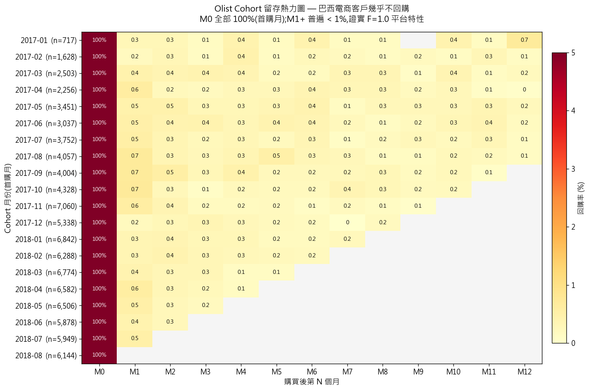
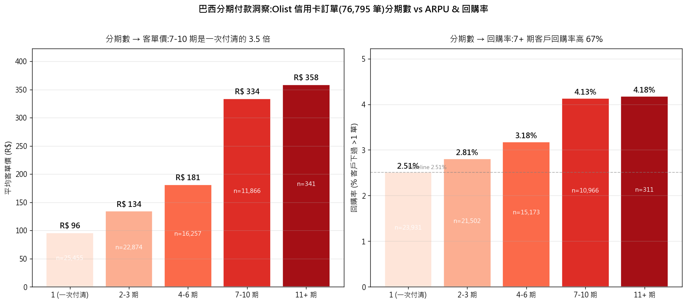

<!-- _class: lead -->

# Olist 巴西電商資料分析

## 從 99K 筆交易找出 **R$ 469K 召回商機** 與 **平台級留存問題**

jenho.cheng · PM Portfolio · 2026

`Python` · `SQL` · `SQLite` · `Tableau`

---

## 為什麼選這份資料?

履歷上常見的 RFM 分析都用 Online Retail UK — **教學資料、單表、12 個月**。

我要找**會在面試講出故事**的資料,三個條件必須都滿足:

| 條件 | Olist 表現 |
|---|---|
| 真實商業資料(非模擬) | ✅ Olist 巴西電商獨角獸 |
| 多表關聯結構 | ✅ **9 張表**,可練 SQL JOIN |
| 完整客戶生命週期 | ✅ 下單 → 出貨 → 評論 → (回購?) |

> 刻意挑「巴西」這個台灣分析師不熟的市場 — 物流落後、信用卡分期文化盛行 — 同樣的方法論套上去會得出**和歐美不同的結論**,避免履歷撞題。

---

## 資料概況 — 規模 & 巴西特色

<div class="columns">

**規模**

- 訂單數 **99,441**
- 獨立客戶 96,096
- 賣家 3,095
- 商品 32,951
- 涵蓋 27 州、4,119 城市
- 時間 2016-09 ~ 2018-10

**巴西特色**

- 信用卡 **73.9%**,平均 **3.5 期**(分期文化)
- Boleto(便利商店繳費單)19.0%
- 地理:SP 占 **41.9%**,東南五州占 **77%**
- 評論:5 星 58%,1 星 12%

</div>

> ⚠️ `customer_id` ≠ `customer_unique_id` — 每筆訂單會生新的 customer_id (n=99,441),但實際只有 96,096 個 unique 客戶。**RFM 必須用 unique_id 才不會誤算**。

---

## 9 張表 ER 圖(關鍵 JOIN 路徑)

```
customers --< orders --< order_items >-- products
                |             |
                |             >-- sellers
                |
                +--< order_payments
                +--< order_reviews
```

**為什麼這份資料適合練 SQL**:任何商業問題都需要 3+ 表 JOIN。
範例:「各州 5 星訂單的平均物流天數」需 `customers + orders + order_reviews` 三表 + 兩個聚合。

(完整 Mermaid ER 圖見 README §4)

---

## 分析架構(10 個分析、9 個結果可重現)

| # | 主題 | 方法 |
|---|---|---|
| 1 | 資料概況 EDA | 多表 COUNT 彙總 |
| 2-5 | 月營收 / 熱銷類別 / 評分分布 / 各州營收 | 時間序列 + JOIN 聚合 |
| 6 | 物流效率(預期 vs 實際)| 雙序列比較 |
| 7 | 整體 KPI 與年度成長 | 跨年比較 |
| **8** | **RFM 客戶分群** | **NTILE(5) Window + 規則分群** |
| **9** | **Cohort 留存熱力圖** | **首購月 × 後續 N 月活躍率** |
| **10** | **分期付款 vs ARPU & 回購率** | **5 桶分組 × 雙指標** |

> 加粗為核心發現,接下來三頁逐一展開。

---

## 發現 1️⃣ — RFM 揭露「F=1.0 平台級單次客」

**6 個客群**(規則式 NTILE(5),非 K-Means)

| Segment | 客戶 % | 營收 % | ARPU |
|---|---:|---:|---:|
| 🏆 冠軍客戶 | 16.2% | **31.4%** | R$ 274 |
| ⚠️ 流失風險 | 23.5% | **35.5%** | R$ 213 |
| 一般客戶 | 20.0% | 19.0% | R$ 134 |
| 忠誠客戶 | 8.2% | 5.1% | R$ 89 |
| 已流失 | 16.5% | 4.7% | R$ 40 |
| 潛力新客 | 15.6% | 4.4% | R$ 40 |

**核心發現**:🏆 冠軍 + ⚠️ 流失 = **39.7% 客戶 / 66.9% 營收**(Pareto)
**致命發現**:**所有 segment 的 F 都 ≈ 1.0** → Olist 處於獲客驅動,不是留存驅動

---

## 發現 1️⃣ 佐證 — Cohort 留存熱力圖



**93,358 客戶,只有 1,693 (1.81%) 跨月回購** · M1 留存 **0.2-0.7%**(成熟電商基準 5-15%)

---

## 發現 2️⃣ — 流失風險召回 ROI 試算

**目標客群**:流失風險群 21,975 人 · 平均 ARPU R$ 213 · 393 天未回購
**假設**:召回 CRM 成本 R$ 50K · 召回客回購金額 = 歷史 ARPU × 50%

| 情境 | 召回率 | 增量營收 | 成本 | **ROI** |
|---|---:|---:|---:|---:|
| 保守 | 5% | R$ 117K | R$ 67K | **2.3×** |
| 樂觀 | 10% | R$ 234K | R$ 184K | **4.7×** |
| 激進 | 20% | **R$ 469K** | R$ 419K | **9.4×** |

> **PM 行動建議優先序**
> 1. 第一波:歷史購買類目 + 個人化 EDM 觸及全部 21,975 人
> 2. 追蹤:開信 → 點擊 → 轉換 vs 控制組
> 3. 召回率 > 8% → 預算翻倍;< 3% → 改打物流升級 / 免運(針對偏遠州)

---

## 發現 3️⃣ — 巴西分期付款是隱形 CRM



**7-10 期 ARPU = 一次付清的 3.48×**(R$334 vs R$96) · **回購率提升 65%**(4.13% vs 2.51%)

---

## 發現 3️⃣ 行動建議

**為什麼這個發現重要**

- **收入槓桿**:推廣分期方案直接拉高 GMV
- **留存槓桿**:分期客戶因「未付清」維持帳務關係,自然降低流失
- **結合來看**:分期不是付款選項,**是 Olist 的隱形 CRM**

**PM 可落地行動**

1. 首頁 / 結帳頁更積極推銷 7+ 期方案(目前僅佔信用卡訂單 15%)
2. 首單一次付清的客戶,第二次到訪推「無息分期」EDM,把低 ARPU + 低回購群往高分期路徑導流
3. 與發卡銀行談更長免息期(現有甜蜜點 8 期 n=4,268,測試 12 期能否拉動更高 ARPU)

> 限制:因果未證實 — 可能是「客單高 → 必須分期」而非「分期 → 客單高」。需 A/B 測試在相同商品頁強制分期 vs 不分期看轉換差異。

---

## 限制與下一步

**誠實聲明**

1. **F 維度鑑別力低** — 90% 客戶只買 1 次,本次分群實際由 R × M 雙維度驅動(已用 Cohort 佐證)
2. **「忠誠客戶」群組金額偏低** — 規則只卡 R≥4, F≥3 沒卡 M,屬規則設計侷限,v2 將加 M 條件
3. **2018 年資料截斷** — Olist 公開資料只到 2018-10,月營收圖已標註紅色虛線
4. **分期付款因果方向待 A/B 測試驗證**

**Phase 2 待辦**

- 商品評分 vs 物流天數相關檢定(量化「物流爛 → 1 星」假設)
- Tableau dashboard 升級為 RFM 分群互動探索
- ROI 召回:擴展為完整 A/B 測試實驗設計提案

---

## 我的差異化定位 vs Kaggle 多數 Notebook

| 多數 Notebook | 我的做法 |
|---|---|
| RFM 跑完直接給 segment summary | 從 F=1.0 推導出**獲客驅動 vs 留存驅動**的業務洞察 |
| 用 Python 套件算 RFM | 用 **SQL Window Function (NTILE)**,可移植到 Snowflake / BigQuery |
| 建議「應該召回流失客戶」 | 量化「召回 10% → R$ 469K → ROI 9.4×」 |
| 跑 K-Means + Silhouette + Davies-Bouldin | 選**規則式分群**,因為業務團隊聽得懂「冠軍客戶」聽不懂「Cluster 3」 |
| 不挖巴西分期付款 | 揭露**分期 = 隱形 CRM**(7+ 期 ARPU 3.48×、回購率 +65%)|

---

<!-- _class: lead -->

# Q&A

**Repo**: github.com/kengkeng44/olist-project

**Tableau Dashboard**: public.tableau.com/profile/jenho.cheng

**重現**:
`python notebook/cohort_analysis.py`
`python notebook/installments_analysis.py`

> Thank you.
